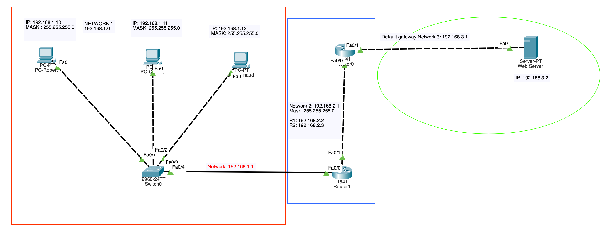

# Building a simple network

## The project's aim

Building a simple network for a young startup **Hackers Poulette** easily scalable where all the host must be connected to internet using a switch and applying the IP addressing to the computers to allow communication between them.

**Addressing table :**

| Devices | LAN | IP | Mask |
|---------|-----|----|------|
| PC-Robert | Eth | 192.168.1.10 | 255.255.255.0 | 
| PC-Camille | Eth | 192.168.1.11 | 255.255.255.0 |
| PC-Renaud | Eth | 192.168.1.12 | 255.255.255.0 |

**Resource Requirements :**

- 1 switch (Cisco 2960 with Cisco IOS version 15.0(2) image lanbasek9 or similar)
- 3 PCs (Windows 10)
- Three Ethernet cables

## Final outcome

